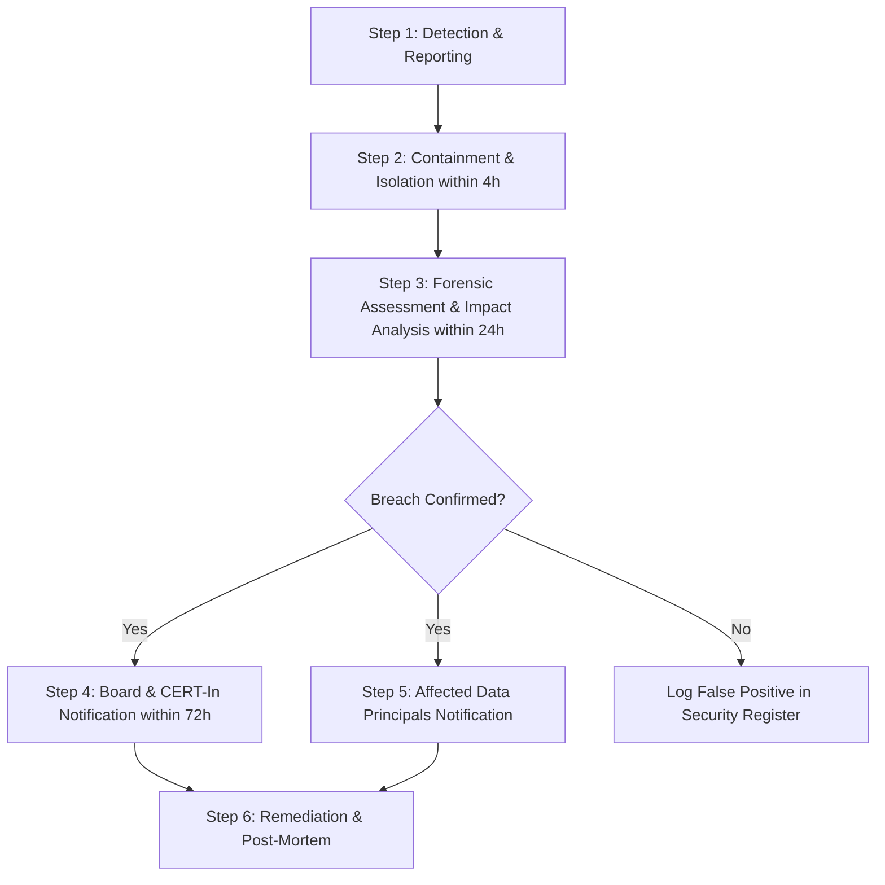

# Personal Data Breach Response Runbook (DPDP Act 2023 / CERT-In)

**Organization:** Incozent Technologies  
**Classification:** Confidential — Internal Security & Compliance  
**Statutory Reference:** Digital Personal Data Protection Act, 2023 (Section 8(6)) & CERT-In Directions  
**Mandatory Notification Window:** Notify the Data Protection Board of India and affected Data Principals promptly, targeting within **72 hours** of breach confirmation (or 6 hours for CERT-In cybersecurity incidents where applicable).

---

## 1. Incident Classification & Severity Matrix

| Level | Severity | Criteria | Escalation Target |
|---|---|---|---|
| **P1 - Critical** | Severe breach exposing high-volume personal data or sensitive project data | Immediate C-Suite, Grievance Officer, Legal Counsel | < 1 hour |
| **P2 - High** | Unauthorized access to Google Sheets or compromised webhook credentials | Grievance Officer, Technical Lead | < 4 hours |
| **P3 - Medium** | Accidental unauthorized sharing of an individual form response or internal email | Grievance Officer | < 12 hours |
| **P4 - Low** | Attempted brute-force or scanner anomaly without data exfiltration | Technical Lead | Next business day |

---

## 2. 72-Hour Response & Escalation Workflow



### Phase 1: Containment (Hours 0 – 4)
1. **Revoke Webhook URL & API Tokens**: If Apps Script or Google Sheets credentials are leaked, immediately revoke the Web App deployment and deploy a fresh version with a regenerated URL.
2. **Access Isolation**: Audit Google Drive permissions; remove unauthorized emails from "Incozent Leads & Inquiries" spreadsheet.
3. **Session Invalidation**: Terminate any active sessions on administrative Google Accounts and enforce 2-Factor Authentication (2FA).

### Phase 2: Assessment (Hours 4 – 24)
1. Identify exact date, time, and vector of unauthorized access.
2. Quantify records compromised (Names, Emails, Phone numbers, Company names, Project requirements).
3. Determine risk to affected Data Principals (identity theft, phishing, commercial exposure).

### Phase 3: Notifications (Hours 24 – 72)
1. Submit official intimation to the **Data Protection Board of India** through the designated regulatory portal.
2. Submit statutory cyber security incident report to **CERT-In** (`incident@cert-in.org.in`) if incident stems from malware, unauthorized system breach, or severe cyber attack.
3. Dispatch individual notifications to affected Data Principals via their registered email addresses.

---

## 3. Communication Templates

### Template A: Statutory Notice to Data Protection Board of India / CERT-In
```text
To: The Data Protection Board of India / Indian Computer Emergency Response Team (CERT-In)
Subject: Intimation of Personal Data Breach under Section 8(6) of the DPDP Act, 2023

1. Data Fiduciary Details:
   - Name: Incozent Technologies
   - Primary Contact: Chittatosha Mohanta, Grievance & Data Protection Officer
   - Email: chittatoshamohanta@incozent.in
   - Registered Address: Bhubaneswar, Odisha, India

2. Nature & Details of Breach:
   - Date and time of occurrence: [YYYY-MM-DD HH:MM IST]
   - Date and time of detection: [YYYY-MM-DD HH:MM IST]
   - Description of breach: [Brief explanation of how incident occurred, e.g. compromised API key, unauthorized access to sheet]

3. Personal Data Categories & Volume:
   - Data points affected: [e.g., Full Name, Email, Organization, Form Messages]
   - Approximate number of Data Principals affected: [e.g., 250 individuals]

4. Likely Impact & Consequences:
   - Potential impact on Data Principals: [e.g., Potential phishing or unsolicited contact]

5. Remedial & Containment Measures Enacted:
   - [Immediate credential revocation, URL regeneration, access containment]
   - [Enhanced logging, multi-factor authentication enforcement]

6. Communication to Data Principals:
   - Affected individuals are being directly notified on [Date/Time] with guidance on safety precautions.

Submitted by:
Chittatosha Mohanta
Grievance Officer, Incozent Technologies
```

---

### Template B: Direct Communication to Affected Data Principals
```text
Subject: [Important Security Notice] Regarding your information with Incozent Technologies

Dear [Data Principal Name],

We are writing to transparently inform you about a recent data security incident at Incozent Technologies that may have involved your contact details.

1. What Happened:
On [Date], our security systems detected unauthorized access affecting [describe system, e.g., an inquiry collection endpoint]. Upon detection, our team immediately isolated the system, revoked affected credentials, and restored full security.

2. What Information Was Involved:
The data potentially accessed was limited to the details you submitted via our website form:
- [List specific items: e.g., Your Name, Email Address, and Company Name]
Please note: No passwords, financial information, government IDs, or biometric samples were involved, as our website does not collect or store such data.

3. What We Have Done:
- Immediately revoked and regenerated all access credentials.
- Hardened access controls and restricted database permissions.
- Reported the incident to the relevant regulatory authorities in accordance with the Digital Personal Data Protection Act, 2023.

4. What You Can Do:
While we have no evidence of misuse of your information, we advise remaining alert to unsolicited communications or phishing attempts referencing Incozent Technologies.

5. Contact Our Grievance Officer:
If you have any questions or require further assistance, please contact our designated Grievance Officer:
- Name: Chittatosha Mohanta
- Email: chittatoshamohanta@incozent.in
- Reference ID: [INC-BRK-YYYY-XXXX]

Sincerely,
Incozent Technologies Team
```

---

## 4. Post-Mortem & Preventive Actions
Within 7 days of full containment:
1. Conduct root-cause analysis (RCA) meeting with engineering and leadership.
2. Update firewall rules, API rate limiters, and access controls.
3. Update `DPDP_PROGRESS.md` and log the incident in the internal Compliance Incident Register.
